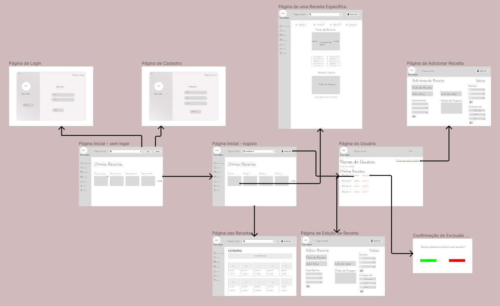
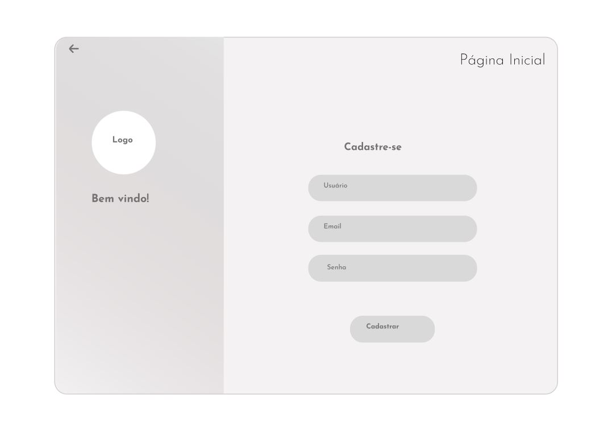
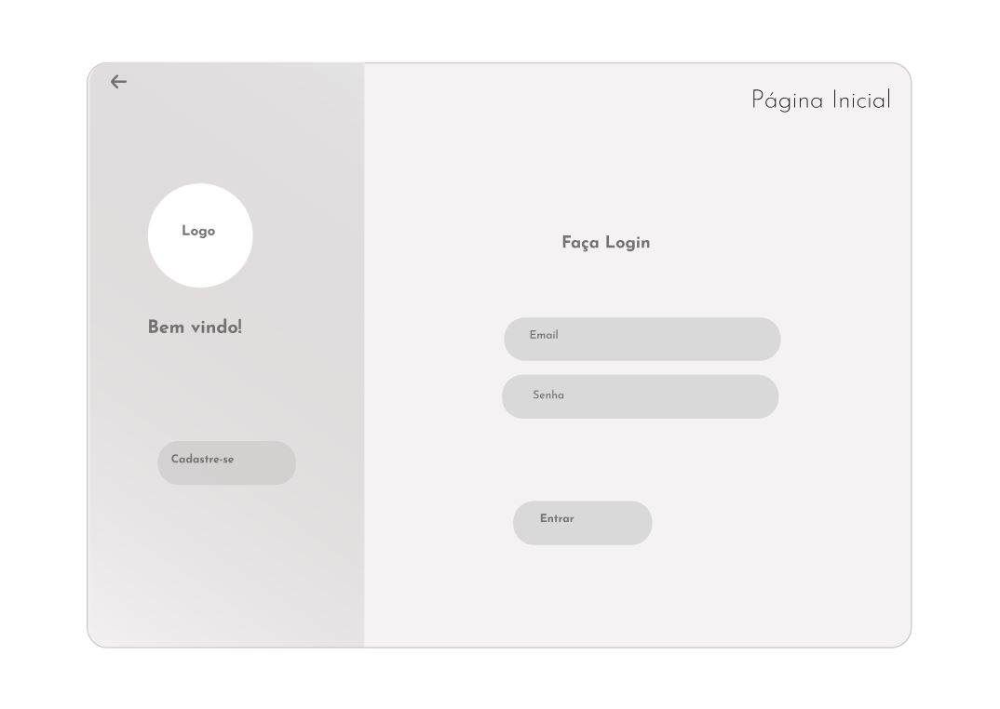
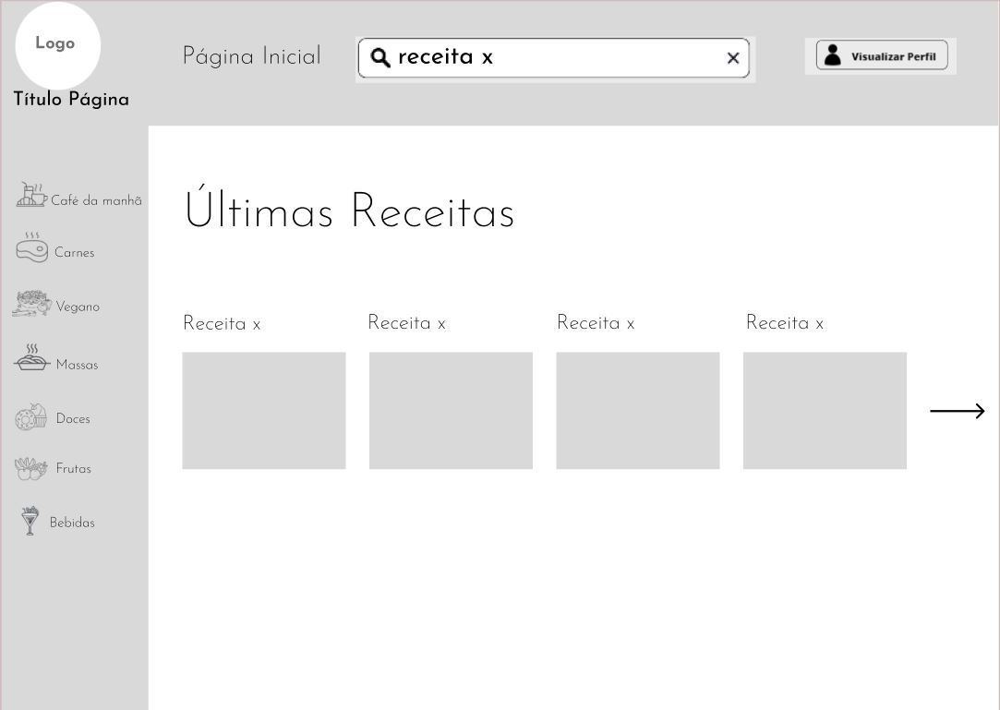
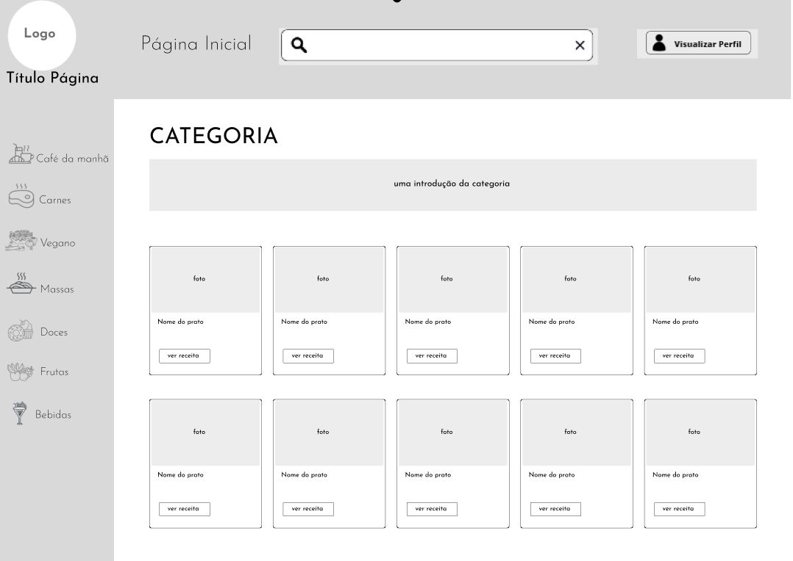
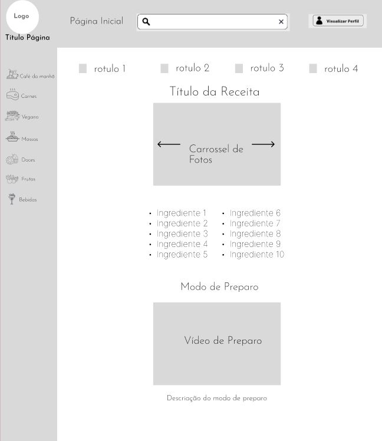
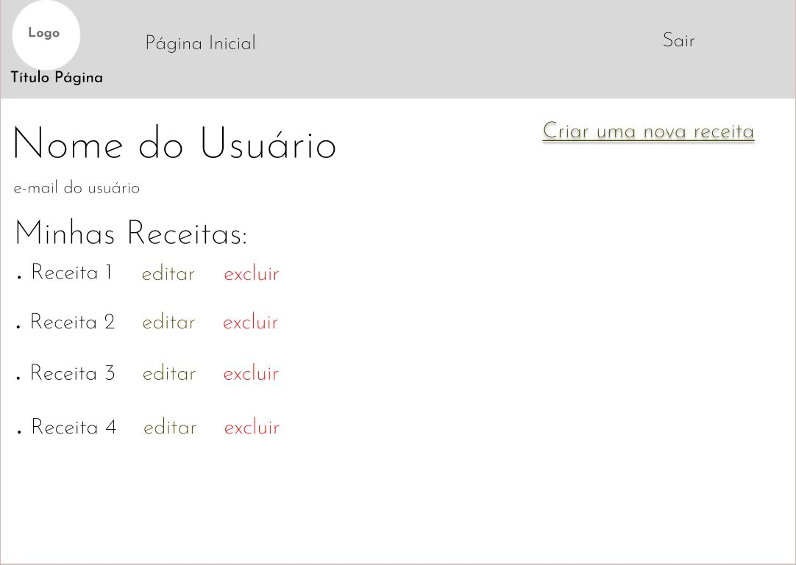

# Projeto de Interface

Pré-requisitos: <a href="2-Especificação do Projeto.md"> Documentação de Especificação</a>

O Projeto de Interface pensado para o Social Chef é projetada para oferecer uma navegação intuitiva, destacando elementos como criação de contas no portal, login e logout para os usuários, barra de pesquisa de receitas, navegação através de categorias e visualização das receitas e suas respectivas instruções. Foram priorizadas usabilidade e acessbilidade, tornando o site amigável para usuários com pouca experiência. A parte estética do portal foi cuidadosamente planejamda para transmitir uma atmosfera acolhedora e calma. O nosso objetivo final é proporcionar uma experiência interativa, facilitando a descoberta e o compartilhamento de conhecimentos culinários.

Para visualizar o Projeto de Interface de maneira completa, acesse o link: https://www.figma.com/file/TPcrtKH7PSEfkgl3esV8Yt/User-Flow-Projeto-1?type=design&mode=design&t=Yh4c8D5w25ck69lZ-1 

## Fluxo de Usuário (User Flow)

A figura imediatamente abaixo apresenta todo o fluxo de navegação planejado do usuário.

Obs.: ao longo do projeto, algumas modificações nos Requisitos foram realizadas, e consequentemente, houveram mudanças no fluxo do usuário. O que não foi incluído na entrega final do projeto poderá ser adicionado em momento futuro oportuno.

## Wireframes

# Estrutura Padrão

As telas são estruturadas de maneira padrão, composta por cabeçalho com barra de pesquisa, botões de interação com a conta, menu lateral com a divisão de receitas em categorias e conteúdo. A exceção são as telas de cadastro e login, que seguem um formato voltado ao preenchimento dos campos obrigatórios. Serão mostrados abaixo, os Wireframes que compõem a versão atual do projeto.

# Página de Cadastro

A Página de Cadastro será o primeiro contato do usuário com a plataforma. O objetivo dessa página é ser o mais intuitivo possível.

# Página de Login

A Página de Login será acessada por quem acabou de criar um conta ou por quem já tem uma conta registrada no site. É uma página muito semelhante à Página de Cadastro.

# Página Inicial

É a primeira página com funcionalidades do sistema voltadas para a visualização de receitas. Composta pela estrutura padrão e corpo de conteúdo com as "Ultimas receitas" adicionadas ao portal.

# Página de Categoria

Esse modelo de página pode ser acessado a partir de qualquer categoria disponível no menu lateral. É muito semelhante ao modelo de Página Inicial.

# Página de Receita Específica

O modelo de página a seguir foi construído para conter todas as informações da receita adicionada ao portal. É uma página informativa, contendo fotos, ingredientes, modo de preparo e outras informações que podem ser necessárias para que a receita seja feita.

# Página de Perfil de Usuário

Foi construída para que o usuário possa criar, ler, atualizar e deletar informações sobre o seu perfil de usuário, incluindo seus dados e receitas que adicionou ou favoritou. 

Possivelmente, a página mais modificada em relação ao planejamento inicial que está ativa. Possui funcionalidades presentes no Wireframe que não foram ao projeto final, e como relatado no início desse relatório, poderá ser atualizada em momento futuro oportuno.

