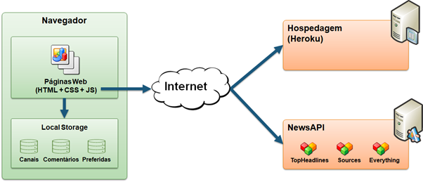

# Arquitetura da Solução

Pré-requisitos: <a href="3-Projeto de Interface.md"> Projeto de Interface</a>

## Tecnologias Utilizadas

A Arquitetura de Solução é a definição de como o software é estruturado em termos dos componentes que fazer parte da solução. É uma parte imprescindível do nosso projeto, no qual a equipe pensou em uma solução que fará o desenvolvimento do projeto mais fludo, moderno e organizado possível.

Nossa solução conta com as seguintes tecnologias: 

- `HTML`: para estruturar uma página web e seu conteúdo;
- `CSS`: para estilizar uma página web e seu conteúdo;
- `Javascript`: linguagem utlizada amplamente em desenvolvimento web, que permite adicionar interatividades e funcionalidades dinâmicas. Com ela, é possível manipular elementos HTML, comunicação com servidores, etc;
- `Firebase`: uma solução de armazenamento oferecida pelo Google, que permite a sincronização de bancos de dados em tempo real com facilidade. Oferece autenticação de usuários nativa, armazenamento de arquivos e outros serviços com escalabilidade e robustez;
- `Hospedagem`: ? 
- `Visual Studio Code`: ambiente de desenvolvimento integrado para criação, execução e correção de um código-fonte;
- `Selenium IDE`: ambiente de criação de scripts de testes automatizados;
- `Figma`: ferramenta criada para desenvolvimento de projetos de interface de software.

Apresente também uma figura explicando como as tecnologias estão relacionadas ou como uma interação do usuário com o sistema vai ser conduzida, por onde ela passa até retornar uma resposta ao usuário

## Diagrama de componentes 

Os componentes que fazem parte da solução são apresentados na figura abaixo:

A solução implementada conta com os seguintes módulos:
- **Navegador** - Interface básica do sistema  
  - **Páginas Web** - Conjunto de arquivos HTML, CSS, JavaScript e imagens que implementam as funcionalidades do sistema.
   - **Banco de Dados** - armazenamento em banco de dados Firebase: 
     - **Autenticação** - e-mail, senha e suas respectivas autenticações;
     - **Perfil de Usuário** - nome e outros dados de identificação do usuário;
 - **Hospedagem** - local na Internet onde as páginas são mantidas e acessadas pelo navegador. 

## Hospedagem

Explique como a hospedagem e o lançamento da plataforma foi feita.