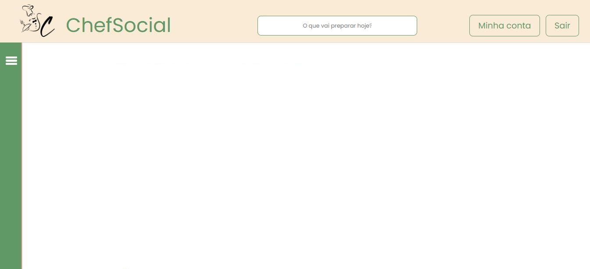
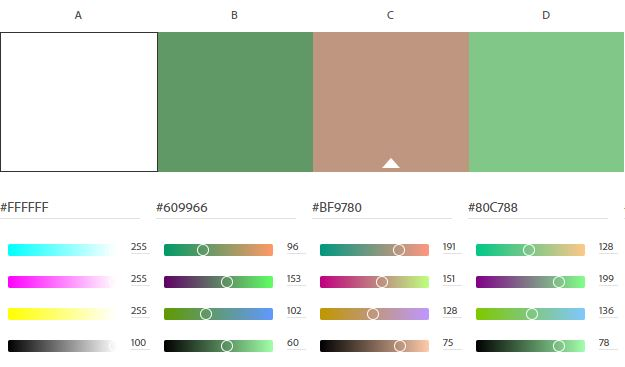

# Template padrão do site

Pré-requisitos: <a href="2-Especificação do Projeto.md"> Especificação do Projeto</a>, <a href="3-Projeto de Interface.md"> Projeto de Interface</a>, <a href="4-Metodologia.md"> Metodologia</a>

A seguir, o layout padrão, composto por cabeçalho com barra de pesquisa, botões de interação com a conta, menu lateral com a divisão de receitas em categorias e conteúdo. A exceção são as telas de cadastro e login, que seguem um formato voltado ao preenchimento dos campos obrigatórios.

A área do cabeçalho mostra o logotipo do projeto, que ao ser clicado direciona o cliente para a página inicial pós autenticação, barra de pesquisa para busca de receitas, botão para o direcionamento para página de pefil de usuário, além do botão de saída, que executa o logout do sistema; O menu lateral em barra expansiva armazena as categorias de receitas; A área central apresenta diferentes atribuções dependendo de qual página está sendo apresentada, podendo exibir as últimas receitas adicionadas ao portal, as receitas de uma categoria e especificamente uma receita escolhida. O rodapé, por sua vez, delimita o final da página, sem maiores atribuições.

A fonte utilizada se chama <a href="https://fonts.google.com/specimen/Poppins">Poppins</a>. Para a pela de cores optamos por uma combinação que conseguisse transmitir serenidade e um ambiente acolhedor. 

