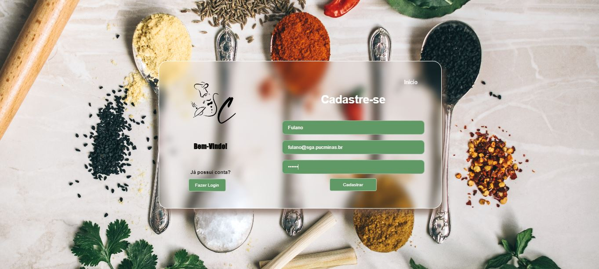
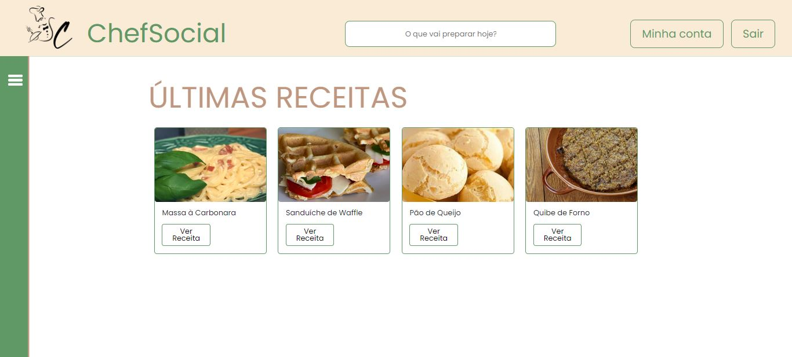
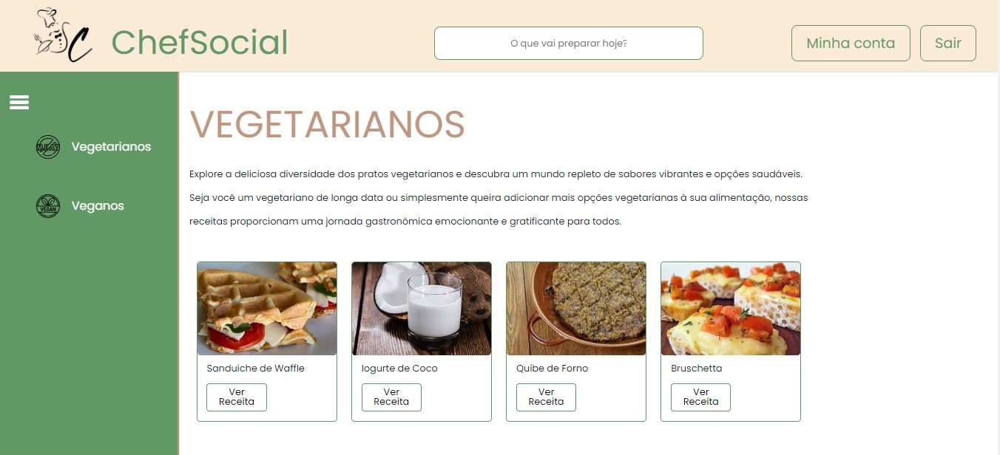
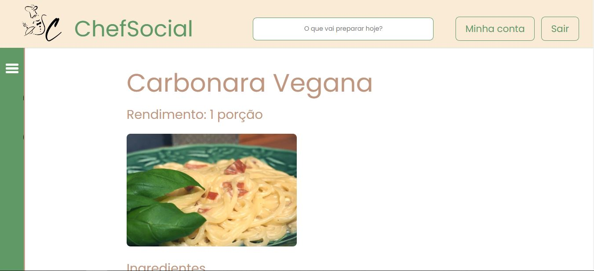
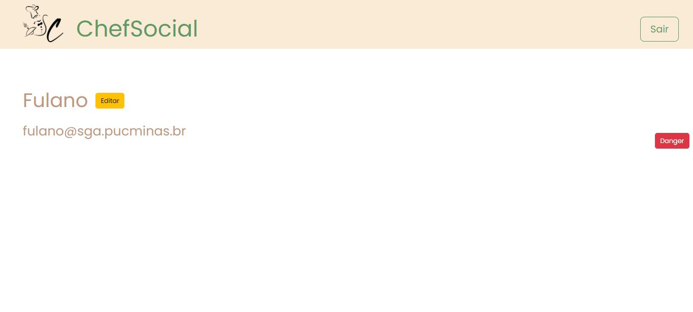
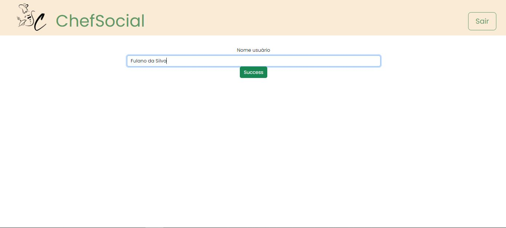
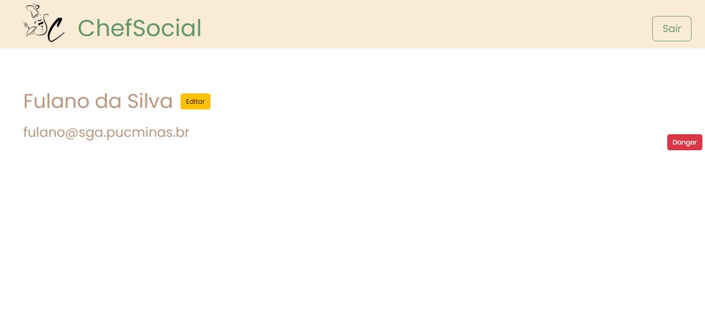

# Programação de Funcionalidades

Pré-requisitos: <a href="2-Especificação do Projeto.md"> Especificação do Projeto</a>, <a href="3-Projeto de Interface.md"> Projeto de Interface</a>, <a href="4-Metodologia.md"> Metodologia</a>, <a href="3-Projeto de Interface.md"> Projeto de Interface</a>, <a href="5-Arquitetura da Solução.md"> Arquitetura da Solução</a>

A seguir, serão apresentados as telas de interação com o usuário final, o requisito funcional atendido e a consequente finalidade.

Os códigos que representam a maior parte dos requisitos funcionais podem ser encontrados na pasta do <a href="../src/js/"> link destacado</a>.

## Página de Cadastro

A partir da Página de Cadastro, o usuário que não possui uma conta válida no site poderá realizar seu cadastro completo, ao preencher os dados e clicar no botão "Cadastrar". Se o cadastro for realizado com sucesso, o usuário será direcionado para a página inicial da aplicação, já autenticado com a conta criada. Essa página contempla o RF-005 (Permitir que o usuário seja capaz de criar e utilizar um cadastro no site) e RF-008 (Permite que o usuário realize a inclusão de dados no seu perfil).

## Página de Login

A Página de Login foi criada para os usuários que já possuem uma conta válida no site e que desejam se autenticar no sistema para utilizá-lo. A utilização dessa página é simples e intuitiva: após preencher os dados de sua conta, o usuário deverá clicar no botão "Entrar". Caso sua solicitação seja um sucesso, ou seja, a conta exista, o usuário será direcionado para a página principal da aplicação. Essa página também contempla o RF-005 (Permitir que o usuário seja capaz de criar e utilizar um cadastro no site).

## Página Inicial

A Página Inicial é a "cara" principal do projeto. É a primeira página que apresenta o template padrão do site, com funcionalidades de pesquisa, acesso a perfil de usuário, menu com categorias e as últimas receitas incluídas no site. Essa página contempla o RF-003 (Permitir que o usuário encontre as páginas de receitas desejadas) e RF-005 (Permitir que o usuário encontre receitas por categorias).

# Página de Categorias

A Página de Categoria é uma modificação leve da página inicial, que apresenta somente a lista de receitas pertencentes a uma categoria específica. É resultado de RF-003 (Permitir que o usuário encontre as páginas de receitas desejadas) e RF-005 (Permitir que o usuário encontre receitas por categorias), aplicados em etapas anteriores.

# Página de Receita Específica

É a página de objetivo final do projeto. Exibe uma receita completa para o usuário. Também é o resultado de de RF-003 (Permitir que o usuário encontre as páginas de receitas desejadas) e RF-005 (Permitir que o usuário encontre receitas por categorias), aplicados em etapas anteriores.

# Página de Perfil de Usuário

A página exibe os dados de usuário do perfil que estiver logado, possibilitando a edição desses dados e a exclusão do perfil. Essa página deveria contemplar o RF-006 (Permitir que os usuários cadastrados sejam capazes de incluir suas receitas no site), mas como explicado anteriormente, alguns requisitos funcionais foram deixados em espera, e contempla o RF-008 (Permite que o usuário realize a inclusão de dados no seu perfil).